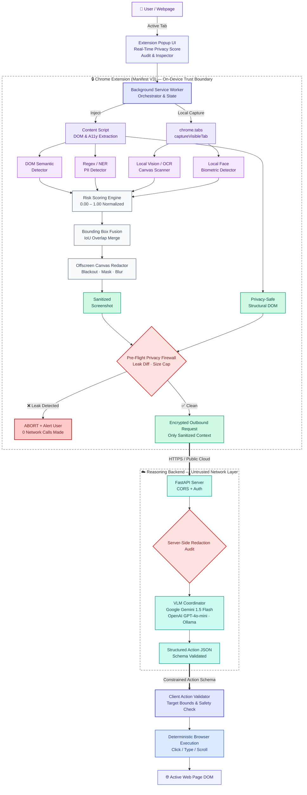

# 🛡️ PrivacyVision — On-Device Privacy-Preserving AI Browser Agent (Chrome Extension)

<p align="center">
  
</p>

<p align="center">
  <strong>Private Visual Intelligence for the Modern Web</strong><br>
  <em>"See locally. Sanitize locally. Reason remotely. Act locally."</em>
</p>

<p align="center">
  <a href="https://github.com/Sarvagya-24-chaturvedi/PrivacyVision/stargazers"></a>
  <a href="https://github.com/Sarvagya-24-chaturvedi/PrivacyVision/network/members"></a>
  <a href="LICENSE"></a>
  <a href="https://developer.chrome.com/docs/extensions/mv3/intro/"></a>
  <a href="https://fastapi.tiangolo.com/"></a>
  <a href="#-critical-privacy-guarantee"></a>
</p>

---

## ⚡ What is PrivacyVision?

**PrivacyVision** is a production-grade, open-source **Google Chrome Extension (Manifest V3)** and cloud reasoning backend that allows autonomous AI agents to browse, inspect, and interact with the web **without ever exposing user credentials, personal identifiers, payment details, or human faces to third-party AI models**.

By placing an un-bypassable cryptographic & visual boundary on your local device, PrivacyVision redacts sensitive pixels in an isolated offscreen canvas and validates all outbound network requests before transmitting them to remote Vision-Language Models (Google Gemini, OpenAI, or local Ollama).

---

## 🚀 Instant 10-Second Install (Free & No Web Store Needed)

You do **not** need to install from the Chrome Web Store. PrivacyVision is 100% open-source and ready to load in developer mode immediately:

### Option A: Download Pre-Packaged ZIP (Fastest)
1. **Download** [`privacyvision-extension.zip`](privacyvision-extension.zip) from this repository (or from [Releases](https://github.com/Sarvagya-24-chaturvedi/PrivacyVision/releases)).
2. **Extract** the ZIP file into a folder on your computer.
3. Open Google Chrome and navigate to `chrome://extensions`.
4. Turn on the **Developer mode** toggle in the top-right corner.
5. Click **Load unpacked** (top-left) and select the extracted folder.
6. 🎉 **PrivacyVision is now installed and active in your Chrome toolbar!**

### Option B: Build from Source
```bash
# Clone the repository
git clone https://github.com/Sarvagya-24-chaturvedi/PrivacyVision.git
cd PrivacyVision/extension

# Install dependencies and build
npm install
npm run build
```
Load the `extension/dist` folder into `chrome://extensions` via **Load unpacked**.

---

## 🆚 Why PrivacyVision? (The Problem with Traditional AI Agents)

| Security Aspect | ❌ Traditional AI Browser Agents | 🛡️ PrivacyVision Chrome Extension |
| :--- | :--- | :--- |
| **Passwords & API Keys** | Transmitted as raw text & full-res screenshots to cloud LLMs | **Physically blacked out locally** in offscreen memory before egress |
| **Credit Cards & CVV** | Uploaded to remote model inference servers | **Masked locally** with algorithmic Luhn checksum verification |
| **National IDs (Aadhaar/PAN)** | Logged in external server chat histories | **Detected on-device** using Verhoeff checksums & pattern redaction |
| **Biometric Face Privacy** | User profile photos streamed unredacted to third parties | **Detected & blurred** with local multi-pass Gaussian filtering |
| **Canvas / Pixel OCR** | Missed by DOM-only tools, leaking visual text | **Scanned with on-device OCR** to redact pixel-only text |
| **Malicious Action Defense** | Runs unconstrained `eval()` and raw browser commands | **Enforces strict schema whitelist** (`CLICK`, `SCROLL`, `TYPE`, etc.) |

---

## 🧠 System Architecture



---

## ✨ Key Features

- 🔒 **100% Manifest V3 Compliant**: Built strictly without deprecated Manifest V2 APIs; uses modern service workers, offscreen documents, and content scripts.
- 🎯 **Multi-Signal Privacy Scoring**: Combines DOM attributes, input types, autocomplete tags, regex pattern matches, semantic label proximity, visual OCR, and face geometry into a normalized risk score ($0.00 \rightarrow 1.00$).
- 🇮🇳 **National Identifier Recognition**: Built-in support for Aadhaar (with full Verhoeff checksum validation), PAN cards (`[A-Z]{5}[0-9]{4}[A-Z]{1}`), phone numbers (`+91`), IFSC codes, and UPI IDs.
- 💳 **Financial & Payment Privacy**: Credit/debit card numbers verified with the Luhn algorithm, CVV/CVC masking, and expiry date parsing.
- 🖼️ **Offscreen Pixel Redaction**: Handles high-DPI displays (`devicePixelRatio`), viewport offsets, overlapping bounding boxes, and nested elements.
- 🚦 **Pre-Flight Privacy Firewall**: Fails closed and drops connections if any unredacted credential or PII pattern is discovered in the outbound request.
- 🤖 **Multi-VLM Cloud Support**: Native integration with **Google Gemini 1.5 Flash**, **OpenAI GPT-4o-mini**, **Ollama (`llava`)**, and an instant zero-latency heuristic engine.
- 🔍 **Real-Time Inspection & Audit Mode**: Built-in side-by-side Before/After inspection viewer and a 9-step cryptographic verification checklist.

---

## 🧪 Interactive Demo Hub & Test Scenarios

The repository includes a standalone, interactive Demo Hub to test real-world privacy protection:

| Demo Scenario | Test Focus | On-Device Privacy Protection Demonstrated |
| :--- | :--- | :--- |
| **Demo 1: Login Page** | Authentication | Passwords & emails blacked out on device; AI finds and clicks submit without credentials. |
| **Demo 2: Payment Gateway** | Financial | Credit cards (Luhn validated), CVV, and UPI IDs masked locally. |
| **Demo 3: KYC / National IDs** | Identity | Aadhaar (Verhoeff checksum), PAN cards, and phone numbers redacted. |
| **Demo 4: Visual Canvas PII** | Pixel Memory | Sensitive email rendered on HTML5 canvas with zero DOM text nodes is detected by local OCR. |
| **Demo 5: Face Blurring** | Biometrics | Human profile portrait blurred locally before transmission. |
| **Demo 6: Multi-Step Navigation** | Autonomous Action | Remote VLM issues `SCROLL` command to reveal hidden buttons and executes `CLICK`. |

To run the demos, simply open `demo/index.html` in Google Chrome!

---

## ☁️ 1-Click Free Cloud Backend Deployment

You can host the reasoning backend 24/7 for free on **Render**, **Koyeb**, or **Fly.io**:

[](https://render.com/deploy?repo=https://github.com/Sarvagya-24-chaturvedi/PrivacyVision)

1. Click the button above (or import `https://github.com/Sarvagya-24-chaturvedi/PrivacyVision` into [Render.com](https://render.com/)).
2. Under **Environment Variables**, add `GEMINI_API_KEY` (Get a free key from [Google AI Studio](https://aistudio.google.com/)).
3. Click **Deploy Web Service**.
4. Paste your public HTTPS URL into the extension's **Cloud / AI Endpoint** input bar and click **Save**!

---

## 🛠️ Local Development & Testing

```bash
# 1. Start Python Backend
cd server
python3 -m venv venv
source venv/bin/activate
pip install -r requirements.txt
uvicorn app.main:app --reload --port 8000

# 2. Run Test Suites
pytest                           # Server unit tests (6/6 passed)
cd ../extension && npm test      # Extension Vitest unit tests (23/23 passed)
```

---

## 🔒 Critical Privacy Guarantee

> **CRITICAL PRIVACY GUARANTEE:**  
> The original unredacted screenshot and plaintext sensitive values **MUST NEVER and WILL NEVER** leave the user's browser. Only sanitized screenshots with physically modified pixels and privacy-safe structural metadata leave the machine boundary.

---

## 🤝 Contributing & Pull Requests

Contributions, feedback, and feature suggestions are warmly welcomed!
1. **Fork** the repository: [https://github.com/Sarvagya-24-chaturvedi/PrivacyVision/fork](https://github.com/Sarvagya-24-chaturvedi/PrivacyVision/fork)
2. Create your feature branch (`git checkout -b feat/amazing-feature`)
3. Commit your changes (`git commit -m 'feat: Add amazing feature'`)
4. Push to the branch (`git push origin feat/amazing-feature`)
5. Open a **Pull Request** and earn your GitHub contributor & **Pull Shark 🦈** badges!

---

## 🌟 Show Your Support

If you believe privacy-preserving AI is the future of autonomous web agents, please **star this repository**! ⭐

[](https://star-history.com/#Sarvagya-24-chaturvedi/PrivacyVision&Date)

---

<p align="center">
  Built with ❤️ for a private and secure open web.
</p>
