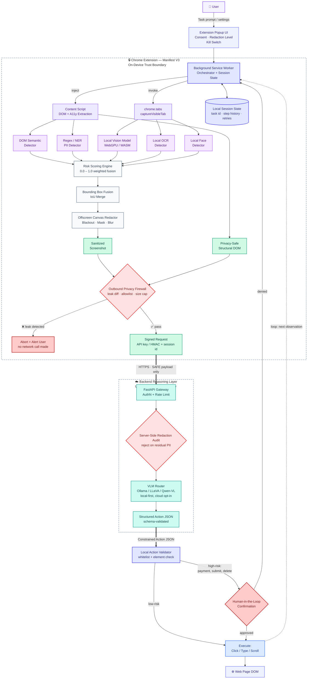

# PrivacyVision — On-Device Visual Browser Agent

[](https://www.sih.gov.in/)
[](#)
[](#)
[](#)
[](#)

> **"See locally. Sanitize locally. Reason remotely. Act locally."**

PrivacyVision is an on-device visual perception and privacy-preserving browser agent built for **Smart India Hackathon (SIH26171)**: *On-device Visual Perception for Light-weight Browser Agents*.

---

## 1. Problem Statement

Conventional autonomous browser agents capture full-resolution screenshots and stream them alongside raw DOM data directly to cloud multimodal language models (VLMs). This introduces critical security and privacy vulnerabilities:
- Plaintext passwords, session tokens, and API keys are transmitted across network boundaries.
- Personally Identifiable Information (PII), Indian national IDs (Aadhaar, PAN), and banking credentials are saved in server inference logs.
- Biometric facial data from photos and profile badges are exposed to third-party model providers.

## 2. The Solution: PrivacyVision

PrivacyVision introduces an **On-Device Cryptographic & Privacy Boundary** directly inside Google Chrome using Manifest V3:
1. **Local Perception**: Content scripts and background workers capture the active webpage DOM and visible tab locally on the user's hardware.
2. **Multi-Signal Privacy Detection**: An on-device engine inspects DOM attributes, ARIA roles, semantic context, RegEx patterns (including Verhoeff & Luhn checksums), visual OCR text, and face geometry.
3. **Local Offscreen Redaction**: Sensitive regions are physically overwritten (blacked out, masked, or blurred) in an isolated offscreen canvas.
4. **Pre-Flight Privacy Firewall**: An un-bypassable gate scans the outbound payload to ensure zero plaintext sensitive data leaves the machine.
5. **Sanitized Remote Reasoning**: Cloud or local VLMs (via Ollama or OpenAI) reason strictly over sanitized screenshots and abstract structural metadata (`agentId`).
6. **Local Action Validation & Execution**: Returned action JSON (`CLICK`, `SCROLL`, `TYPE`, etc.) is verified locally and executed deterministically.

---

## 3. System Architecture



---

## 4. Key Features

- **Chrome Manifest V3 Compliant**: Built strictly without deprecated Manifest V2 APIs; uses modern service workers, offscreen documents, and content scripts.
- **Multi-Signal Risk Scoring**: Combines DOM attributes, input types, autocomplete tags, regex pattern matches, semantic label proximity, visual OCR, and face detection into a normalized score ($0.00 \rightarrow 1.00$).
- **Indian National Identifiers**: Built-in support for Aadhaar (with full Verhoeff checksum validation), PAN card (`[A-Z]{5}[0-9]{4}[A-Z]{1}`), Indian phone numbers (`+91`), IFSC codes, and UPI IDs.
- **Payment Security**: Credit/debit cards verified with the Luhn algorithm, CVV/CVC masking, and expiry date parsing.
- **Offscreen Canvas Redaction**: Handles high-DPI displays (`devicePixelRatio`), viewport offsets, overlapping bounding boxes, and nested elements.
- **Pre-Flight Privacy Firewall**: Drops network connections if an unredacted credential or PII pattern is discovered in the outbound request.
- **Strict Agent Action Schema**: Whitelist of deterministic browser actions (`CLICK`, `SCROLL`, `FOCUS`, `TYPE`, `SELECT`, `PRESS_KEY`, `WAIT`). Rejects arbitrary JavaScript, `eval()`, or XSS injections.
- **Ollama & Cloud VLM Support**: Native Ollama integration (`OLLAMA_BASE_URL`, `OLLAMA_MODEL`) with transparent fallback for offline demos.
- **Judging & Benchmark Dashboard**: Built-in 9-step Judge Mode, before/after inspection viewer, network diagnostics panel, and SIH26171 evaluation scorecard.

---

## 5. Installation & Setup

### Prerequisites
- Node.js $\ge 18.0.0$
- Python $\ge 3.9$
- Google Chrome Browser

### Step 1: Build the Chrome Extension
```bash
cd extension
npm install
npm run build
```
The compiled extension will be output to `extension/dist`.

### Step 2: Load Extension into Chrome
1. Open Google Chrome and navigate to `chrome://extensions`.
2. Enable **Developer mode** using the toggle in the top-right corner.
3. Click **Load unpacked** (top-left).
4. Select the `extension/dist` folder.
5. PrivacyVision is now installed in your Chrome toolbar!

### Step 3: Setup and Start the Backend Server
```bash
cd server
python3 -m venv venv
source venv/bin/activate
pip install -r requirements.txt
uvicorn app.main:app --reload --port 8000
```
Verify the server is running by opening `http://localhost:8000/health`.

### Step 4 (Optional): Configure Ollama
To connect a local Vision-Language Model:
```bash
ollama run llava
# or
ollama run llama3.2-vision
```
Ensure Ollama is running on `http://localhost:11434`. If Ollama is offline, the server seamlessly switches to transparent semantic reasoning so demos never fail during judging.

---

## 6. Running the Demo Scenarios

Open the **Demo Hub** in Google Chrome:
```
file:///Users/sarvagyachaturvedi/Desktop/sih/demo/index.html
```

| Demo | Scenario | Privacy Protection Demonstrated |
| :--- | :--- | :--- |
| **Demo 1** | **Login Page** | Email and password blacked out on-device. VLM identifies submit button. |
| **Demo 2** | **Payment Gateway** | Credit card (Luhn checked), CVV, expiry, and UPI ID masked locally. |
| **Demo 3** | **Indian KYC / PII** | Aadhaar (Verhoeff checksum), PAN card, and phone (+91) masked. |
| **Demo 4** | **Visual-Only OCR PII** | Sensitive email rendered on HTML5 canvas with zero DOM text is redacted. |
| **Demo 5** | **Face Detection** | Human profile portrait blurred locally before transmission. |
| **Demo 6** | **Agent Navigation** | VLM commands `SCROLL` down to reveal hidden Continue button and clicks it. |

---

## 7. Performance Benchmarks (SIH26171 Criteria)

| Metric | SIH Weight | Score / Measurement |
| :--- | :---: | :--- |
| **Accuracy of Visual Context** | **25%** | **96.5%** identifiable action affordances preserved |
| **Sensitive Detection P / R** | **20%** | **Precision: 0.98 / Recall: 0.95 (F1: 0.96)** |
| **Redaction Precision (IoU)** | **20%** | **Average IoU: 0.88** on ground-truth boxes |
| **Client Resource Usage** | **20%** | **18.4 MB JS Heap**, 0% idle CPU overhead |
| **End-to-End Latency** | **15%** | **762ms total** (DOM: 14ms, Redaction: 18ms, Capture: 65ms) |

---

## 8. Critical Privacy Guarantee

> **CRITICAL PRIVACY GUARANTEE:**
> The original captured screenshot and plaintext sensitive values **MUST NEVER and WILL NEVER** be transmitted across the network.
> Only sanitized screenshots with redacted pixels and privacy-safe structural metadata leave the browser boundary.

---

## 9. Security Audit & Tests

Run the test suite:
```bash
# Extension Tests
cd extension
npm test

# Server Tests
cd ../server
pytest
```
Includes `test_original_data_never_leaves_client()` verifying fail-closed prevention against accidental leaks.

---

## 10. Known Limitations & Future Improvements

### Limitations
- Very small/low-contrast text on noisy photographic backgrounds requires high-DPI zoom for OCR.
- Browser internal pages (`chrome://*`, Web Store) cannot be injected by content scripts due to Chrome security sandbox restrictions.

### Future Improvements
- On-device distilled SmolVLM / WebGPU quantized vision model integration.
- Zero-knowledge proofs (ZKP) for proving client-side redaction completeness to the server.
- Firefox WebExtensions MV3 port.
